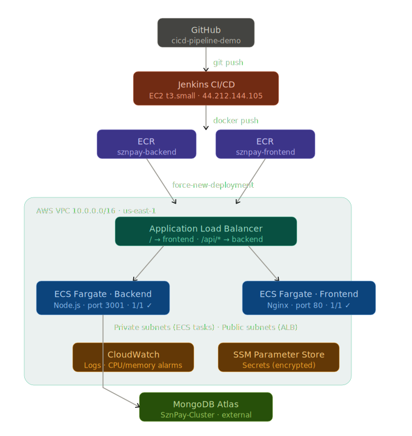
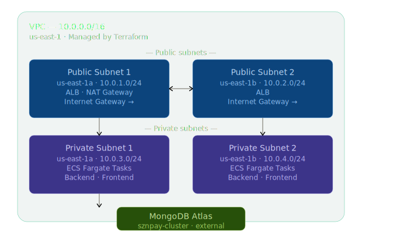
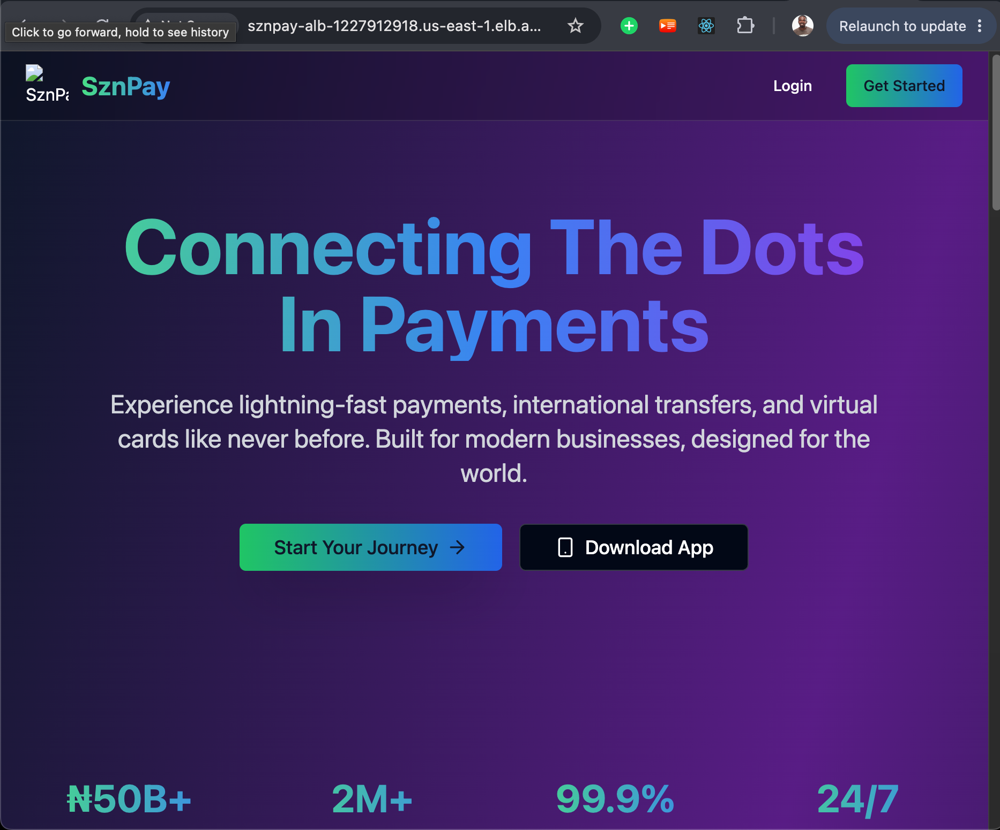

# SznPay — Production DevOps Deployment
### Damolak Technologies — DevOps Engineer Practical Challenge

> **Live Application:** http://sznpay-alb-1227912918.us-east-1.elb.amazonaws.com  
> ⚠️ **Note:** Application is served over HTTP (not HTTPS). Please access using `http://` explicitly — browsers may default to HTTPS and time out.
> **AWS Account:** `217019990405` | **Region:** `us-east-1`  
> **Submitted by:** Favour Ninedeys

---

## Table of Contents
- [Overview](#overview)
- [Architecture](#architecture)
- [Tech Stack](#tech-stack)
- [Infrastructure as Code](#infrastructure-as-code)
- [CI/CD Pipeline](#cicd-pipeline)
- [Application](#application)
- [Monitoring & Logging](#monitoring--logging)
- [Security](#security)
- [How to Deploy](#how-to-deploy)

---

## Overview

This project demonstrates a **production-ready deployment** of SznPay — a full-stack Nigerian fintech application — on AWS using modern DevOps practices.

The deployment covers:
- **Infrastructure as Code** with Terraform (modular, remote state)
- **Containerisation** with Docker (multi-stage builds)
- **CI/CD Pipeline** with Jenkins (automated test → build → push → deploy)
- **Container Orchestration** with AWS ECS Fargate
- **Monitoring** with AWS CloudWatch

---

## Architecture



```
Developer Push
      │
      ▼
 GitHub (main branch)
      │
      │ webhook trigger
      ▼
 Jenkins CI/CD (EC2 t3.small)
      │
      ├─── Run Unit Tests (Jest — 202 tests)
      ├─── Lint Frontend
      ├─── Docker Build + Push → AWS ECR
      │         ├── sznpay-backend:latest
      │         └── sznpay-frontend:latest
      │
      └─── Deploy → AWS ECS Fargate
                │
                ├── Backend Service  (Node.js/Express — port 3001)
                └── Frontend Service (React/Vite/Nginx — port 80)
                          │
                          ▼
              Application Load Balancer
              sznpay-alb-1227912918.us-east-1.elb.amazonaws.com
                          │
                    ┌─────┴─────┐
                    │           │
              /api/*          /
            Backend        Frontend
```


### AWS Infrastructure Diagram



```

---

## Tech Stack

| Layer | Technology | Reason |
|-------|-----------|--------|
| Frontend | React + Vite + TypeScript | Modern SPA framework |
| Backend | Node.js + Express | RESTful API server |
| Database | MongoDB Atlas | Managed NoSQL, external |
| Containerisation | Docker (multi-stage) | Reproducible builds |
| Container Registry | AWS ECR | Native AWS integration |
| Orchestration | AWS ECS Fargate | Serverless containers |
| Load Balancer | AWS ALB | Path-based routing |
| CI/CD | Jenkins | Assessor preference, pipeline-as-code |
| IaC | Terraform | Modular, remote state |
| Monitoring | AWS CloudWatch | Native metrics + alarms |
| Secrets | AWS SSM Parameter Store | Encrypted secret injection |

---

## Infrastructure as Code

All infrastructure is managed via **Terraform** with a modular structure.

### Remote State
```
S3 Bucket:      damolak-tfstate-217019990405
DynamoDB Table: damolak-tfstate-lock
State Key:      damolak/sznpay/terraform.tfstate
```

### Module Structure
```
terraform/
├── main.tf           # Root — wires all modules
├── variables.tf      # Input variables
├── outputs.tf        # Output values
├── backend.tf        # S3 remote state config
└── modules/
    ├── vpc/          # VPC, subnets, IGW, NAT, route tables
    ├── ecr/          # ECR repositories + lifecycle policies
    ├── ecs/          # ECS cluster, task definitions, services, IAM
    ├── alb/          # Application Load Balancer + target groups
    └── monitoring/   # CloudWatch alarms
```

### Key Resources Provisioned
- VPC with 2 public + 2 private subnets across 2 AZs
- Internet Gateway + NAT Gateway (HA outbound for ECS tasks)
- Application Load Balancer with path-based routing
- ECS Cluster (Fargate) with Container Insights enabled
- ECR repositories (scan on push, 10-image lifecycle policy)
- SSM SecureString parameters for all application secrets
- IAM execution + task roles with least-privilege policies
- CloudWatch log groups + CPU/memory alarms

### Deploy Infrastructure
```bash
cd terraform
terraform init
terraform plan
terraform apply
```

---

## CI/CD Pipeline

The Jenkins pipeline is defined as code in `Jenkinsfile` at the repo root.

### Pipeline Stages

```
Checkout SCM → Checkout → Test Backend → Lint Frontend →
Build & Push Backend → Build & Push Frontend → Deploy to ECS
```

| Stage | What it does |
|-------|-------------|
| Checkout | Pulls latest code from GitHub |
| Test Backend | Runs 202 Jest unit tests with `--forceExit` |
| Lint Frontend | Installs frontend dependencies |
| Build & Push Backend | Builds Docker image, tags with build number, pushes to ECR |
| Build & Push Frontend | Same for frontend (multi-stage: Node build → Nginx serve) |
| Deploy to ECS | Triggers force-new-deployment on both ECS services |

### Jenkins Server
```
Instance:  i-0be963a23f5d70756 (t3.small)
Public IP: 44.212.144.105 (Elastic IP — permanent)
UI:        http://44.212.144.105:8080
Region:    us-east-1
```

### Trigger
Pipeline triggers automatically on every push to `main` branch via GitHub webhook.

### Secrets Management
All secrets stored in Jenkins Credentials Store (encrypted), never hardcoded:
- `aws-credentials` — AWS access key for ECR push + ECS deploy
- Application secrets injected via AWS SSM at container runtime

---

## Application

**SznPay** is a Nigerian fintech platform with:
- User authentication (JWT + refresh tokens)
- Wallet management and transfers
- Bill payments (electricity, airtime, data, cable TV)
- Investment portfolio management
- Multi-language AI banking (English, Pidgin, Yoruba, Igbo, Hausa)
- KYC verification
- Real-time transaction engine

### Backend
```
Runtime:  Node.js 20 + Express
Port:     3001
Health:   GET /health
Tests:    202 unit tests (Jest)
```

### Frontend
```
Framework: React + Vite + TypeScript
Build:     Multi-stage Docker (Node build → Nginx serve)
Port:      80
```

### Live URLs
| Service | URL |
|---------|-----|
| Application | http://sznpay-alb-1227912918.us-east-1.elb.amazonaws.com |
| API Health | http://sznpay-alb-1227912918.us-east-1.elb.amazonaws.com/health |

> ⚠️ **Important:** Use `http://` explicitly in your browser address bar. Modern browsers auto-redirect to HTTPS which is not yet configured — this will cause a timeout.

### Application Preview


| Jenkins | http://44.212.144.105:8080 |

---

## Monitoring & Logging

### CloudWatch Log Groups
| Log Group | Retention |
|-----------|-----------|
| `/ecs/sznpay-backend` | 7 days |
| `/ecs/sznpay-frontend` | 7 days |

### CloudWatch Alarms
| Alarm | Metric | Threshold |
|-------|--------|-----------|
| `sznpay-backend-high-cpu` | ECS CPUUtilization | > 80% |
| `sznpay-backend-high-memory` | ECS MemoryUtilization | > 80% |
| `sznpay-frontend-high-cpu` | ECS CPUUtilization | > 80% |

### Container Insights
ECS cluster has **Container Insights** enabled — provides automatic CPU, memory, network, and storage metrics per service and task.

---

## Security

| Control | Implementation |
|---------|---------------|
| Network isolation | ECS tasks in private subnets, only ALB is public |
| Secret management | AWS SSM SecureString (KMS encrypted) |
| Container scanning | ECR scan-on-push enabled |
| IAM least privilege | Separate execution + task roles, scoped policies |
| No hardcoded secrets | All credentials in Jenkins store or SSM |
| HTTPS ready | ALB configured for SSL termination (cert pending) |

---

## How to Deploy

### Prerequisites
- AWS CLI configured for account `217019990405`
- Terraform >= 1.5.0
- Docker
- Git

### 1. Clone the repository
```bash
git clone https://github.com/IAM-Mavericks/cicd-pipeline-demo
cd cicd-pipeline-demo
```

### 2. Bootstrap Terraform state
```bash
aws s3api create-bucket \
  --bucket damolak-tfstate-217019990405 \
  --region us-east-1

aws dynamodb create-table \
  --table-name damolak-tfstate-lock \
  --attribute-definitions AttributeName=LockID,AttributeType=S \
  --key-schema AttributeName=LockID,KeyType=HASH \
  --billing-mode PAY_PER_REQUEST \
  --region us-east-1
```

### 3. Deploy infrastructure
```bash
cd terraform
cp terraform.tfvars.example terraform.tfvars
# Fill in your secrets in terraform.tfvars
terraform init
terraform apply
```

### 4. Configure Jenkins
- Access Jenkins at `http://<jenkins-ip>:8080`
- Add AWS credentials (ID: `aws-credentials`)
- Create pipeline job pointing to this repo
- Set branch to `*/main`

### 5. Trigger deployment
```bash
git push origin main
# Jenkins automatically builds and deploys
```

---

## Pipeline Run History

The pipeline went through **15 builds** during this challenge, resolving real-world issues:

| Issue | Fix |
|-------|-----|
| `npm: command not found` | Installed Node.js 20 on Jenkins server |
| Jest hanging (49min) | Limited to unit tests with `--forceExit` |
| pnpm lockfile missing | Switched to `npm --no-frozen-lockfile` |
| Docker peer dependency conflict | Added `--legacy-peer-deps` |
| Docker build context 600MB | Added `.dockerignore` |
| Jenkins disk full (379MB) | Cleaned Docker cache, expanded EBS 8GB→20GB |
| Server OOM crashes | Added 2GB swap space |
| IP changed after reboot | Assigned Elastic IP `44.212.144.105` |

> These are not failures — they are the real engineering work that makes a deployment production-ready.

---

*Deployed on AWS us-east-1 | Terraform-managed | Jenkins CI/CD | ECS Fargate*
